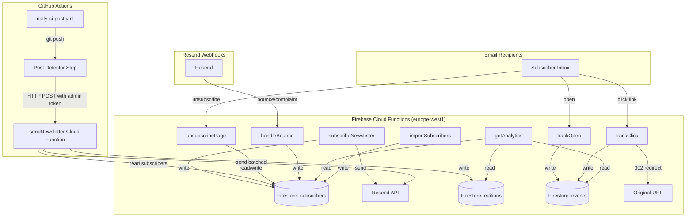

# Design Document: Self-Hosted Newsletter

## Overview

This design replaces the Beehiiv newsletter platform with a fully self-hosted system built on the existing Firebase Cloud Functions + Firestore infrastructure. The system manages the complete newsletter lifecycle: subscription, segmentation, automated sending triggered by new blog posts, engagement tracking (opens/clicks), bounce handling, and analytics.

The architecture follows the existing pattern in `functions/index.js` — `onRequest` handlers with `region: "europe-west1"`, `cors: true`, and `secrets` arrays. Resend remains the email delivery provider. GitHub Actions detects new posts and triggers the newsletter dispatch via an authenticated HTTP call to a Cloud Function.

### Key Design Decisions

1. **Jekyll static unsubscribe page** — the preference page is a static Jekyll page that calls a Cloud Function API to load/save preferences. This keeps the page within the site's design system and avoids rendering HTML in Cloud Functions.
2. **Token-based subscriber identification** using crypto-random tokens stored as SHA-256 hashes — same pattern as the existing job risk report tokens.
3. **Manual compose and send** — the author selects posts, features content, and triggers sends via an authenticated API call.
4. **Batched sending with Firestore queue** — editions are processed in batches of 10 with 1-second delays to respect Resend's rate limits (10 emails/second on free tier).
5. **Two segments by default** — "main_website" and "sproochentest_prep" — stored as an array on each subscriber document.

## Architecture



### Function Inventory

| Function | Method | Auth | Secrets | Purpose |
|----------|--------|------|---------|---------|
| `subscribeNewsletter` | POST | Public (CORS) | RESEND_API_KEY | Subscribe + welcome email |
| `newsletterPreferences` | GET/POST | Token in URL | — | Load/save unsubscribe preferences |
| `manageSubscribers` | GET/POST | Firebase ID token | — | List, add, deactivate, delete subscribers |
| `sendNewsletter` | GET/POST | Firebase ID token | RESEND_API_KEY | List posts / compose & send edition |
| `trackOpen` | GET | Pixel token | — | Record open event, return PNG |
| `trackClick` | GET | Click token | — | Record click event, 302 redirect |
| `handleBounce` | POST | Webhook signature | — | Process Resend bounce/complaint |
| `getAnalytics` | GET | Firebase Admin auth | — | Return edition/subscriber stats |
| `importSubscribers` | POST | Firebase Admin auth | — | Bulk import from CSV |

## Components and Interfaces

### 1. Subscriber Manager (`subscribeNewsletter`)

```javascript
// POST /subscribeNewsletter
// Request body:
{
  "email": "user@example.com",
  "utm_source": "homepage_form"  // optional, defaults to "website"
}

// Response (200):
{ "result": "success" }

// Response (400):
{ "error": "Invalid email" }
```

**Behavior:**
- Validates email format using regex `^[^\s@]+@[^\s@]+\.[^\s@]+$`
- Normalizes email to lowercase + trim
- Checks if subscriber exists in Firestore by email
  - If active: returns success (idempotent)
  - If unsubscribed: reactivates, sets `reactivatedAt` timestamp
  - If new: creates record with crypto-random unsubscribe token
- Sends welcome email on new creation or reactivation
- Stores `unsubscribeTokenHash` (SHA-256 of the raw token) on the subscriber doc

### 2. Unsubscribe Preference Page (Jekyll static page + Cloud Function API)

**Jekyll page:** `/newsletter/preferences/` (static HTML with JavaScript)

The page reads the `token` query parameter, calls a Cloud Function to load the subscriber's current segments, and displays checkboxes. On submit, it calls another endpoint to save preferences.

**Cloud Function API:**

```javascript
// GET /newsletterPreferences?token=<64-char-hex>
// Returns subscriber's current segments
// Response (200):
{
  "segments": ["main_website", "sproochentest_prep"],
  "email": "u***@example.com"  // masked for display
}

// Response (404):
{ "error": "not_found" }

// POST /newsletterPreferences
// Request body:
{
  "token": "<64-char-hex>",
  "segments": ["main_website"]  // segments to remain subscribed to (empty = unsubscribe all)
}

// Response (200):
{ "result": "success", "status": "active" }  // or "unsubscribed" if segments is empty
```

**Jekyll page behavior:**
- Reads `?token=` from URL
- Calls `GET /newsletterPreferences?token=...` to load current state
- Displays two checkboxes: "The Second Mind (AI, risk, operations)" and "Sproochentest Prep"
- Pre-checks boxes based on current segments
- On submit, calls `POST /newsletterPreferences` with selected segments
- If all unchecked: shows "You have been unsubscribed" confirmation
- If some checked: shows "Preferences updated" confirmation
- Invalid token: shows generic "invalid or expired link" message
- Supports RFC 8058 one-click unsubscribe via POST with empty body (unsubscribes from all)

### 2b. Subscriber Management API (`manageSubscribers`)

```javascript
// GET /manageSubscribers?action=list&status=active
// Headers: { "Authorization": "Bearer <firebase-id-token>" }
// Response (200):
{
  "subscribers": [
    { "id": "doc_id", "email": "user@example.com", "status": "active", "segments": ["main_website", "sproochentest_prep"], "utmSource": "homepage_form", "subscribedAt": "2026-01-15T10:00:00Z" },
    ...
  ],
  "total": 150
}

// POST /manageSubscribers?action=add
// Headers: { "Authorization": "Bearer <firebase-id-token>" }
// Body: { "email": "new@example.com" }
// Response (200): { "result": "success", "id": "doc_id" }
// Response (409): { "error": "Subscriber already exists" }

// POST /manageSubscribers?action=deactivate
// Headers: { "Authorization": "Bearer <firebase-id-token>" }
// Body: { "id": "doc_id" }
// Response (200): { "result": "success" }

// POST /manageSubscribers?action=delete
// Headers: { "Authorization": "Bearer <firebase-id-token>" }
// Body: { "id": "doc_id" }
// Response (200): { "result": "success" }
```

**Behavior:**
- All actions require Firebase ID token verification
- `list`: Returns subscribers filtered by optional status, sorted by `subscribedAt` descending
- `add`: Creates subscriber with status "active", segments `["main_website", "sproochentest_prep"]`, utm_source "admin_added"
- `deactivate`: Sets status to "unsubscribed", records timestamp, no notification sent
- `delete`: Permanently removes subscriber doc and all associated events from Firestore

### 3. Newsletter Dispatcher (`sendNewsletter`)

```javascript
// GET /sendNewsletter?action=listPosts
// Headers: { "Authorization": "Bearer <firebase-id-token>" }
// Response (200):
{
  "posts": [
    { "filename": "2026-05-24-ai-job-risk.md", "title": "AI Job Risk...", "date": "2026-05-24", "excerpt": "...", "url": "https://hasanjaffal.com/2026-05-24-ai-job-risk/", "tags": ["ai-and-work"] },
    ...
  ]
}

// POST /sendNewsletter
// Headers: { "Authorization": "Bearer <firebase-id-token>" }
// Request body:
{
  "subject": "The Second Mind #12 — AI Job Risk Is Not About Your Title",
  "posts": ["2026-05-24-ai-job-risk.md", "2026-05-20-dashboard-failures.md"],
  "featuredPost": {
    "title": "Why Dashboards Fail Under Pressure",
    "excerpt": "Most dashboards report what happened. Few help you decide what to do next...",
    "url": "https://hasanjaffal.com/2026-05-20-dashboard-failures/"
  },
  "toolInvitation": {
    "name": "AI Job Risk Assessment",
    "description": "Find out how exposed your role is to AI automation.",
    "url": "https://hasanjaffal.com/ai-job-risk-analyzer/"
  },
  "segment": "main_website"
}

// Response (200):
{ "result": "success", "editionId": "abc123", "recipientCount": 150 }
```

**Behavior:**
- GET with `action=listPosts`: Reads `_posts/` metadata from Firestore (synced during build) or fetches from site RSS feed, returns sorted by date descending
- POST: Validates admin auth via Firebase ID token verification
- Validates subject is non-empty and at least one post is selected
- Queries active subscribers for the target segment
- Renders HTML email template with: post cards, featured post section, tool invitation section
- All links (post links, featured CTA, tool link) rewritten through click proxy
- Sends in batches of 10 with 1-second delays between batches
- Each email gets personalized unsubscribe link and unique tracking pixel
- Creates edition document in Firestore with full metadata
- Logs individual send failures but continues processing

### 4. Tracking Pixel (`trackOpen`)

```javascript
// GET /trackOpen?t=<tracking-token>
// Returns: 1x1 transparent PNG
// Headers: Cache-Control: no-store, no-cache
```

**Behavior:**
- Decodes tracking token (base64url-encoded JSON: `{s: subscriberId, e: editionId}`)
- Records open event in Firestore `events` collection
- Only counts first open per subscriber-edition pair (uses compound document ID)
- Always returns valid PNG regardless of token validity

### 5. Click Proxy (`trackClick`)

```javascript
// GET /trackClick?t=<tracking-token>&url=<base64url-encoded-destination>
// Returns: 302 redirect to destination URL
```

**Behavior:**
- Decodes tracking token and destination URL
- Records click event in Firestore `events` collection
- Redirects to original URL with 302
- Invalid token: redirects to `https://hasanjaffal.com` without recording

### 6. Bounce Handler (`handleBounce`)

```javascript
// POST /handleBounce
// Headers: { "svix-id": "...", "svix-timestamp": "...", "svix-signature": "..." }
// Body: Resend webhook payload
```

**Behavior:**
- Validates Svix webhook signature using `RESEND_WEBHOOK_SECRET`
- Extracts event type: `email.bounced`, `email.complained`, `email.delivery_delayed`
- Hard bounce: sets subscriber status to "bounced"
- Complaint: sets subscriber status to "complained"
- Soft bounce (delivery_delayed): increments `softBounceCount`, checks 30-day rolling window
- 3+ soft bounces in 30 days → status "bounced"

### 7. Analytics (`getAnalytics`)

```javascript
// GET /getAnalytics?type=editions
// Headers: { "Authorization": "Bearer <firebase-id-token>" }
// Response (200):
{
  "editions": [
    {
      "id": "abc123",
      "subject": "The Second Mind #12 — AI Job Risk",
      "segment": "main_website",
      "recipientCount": 150,
      "uniqueOpens": 45,
      "uniqueClicks": 12,
      "openRate": 30.0,
      "clickRate": 8.0,
      "sentAt": "2026-05-24T10:00:00Z"
    },
    ...
  ]
}

// GET /getAnalytics?type=edition&id=<editionId>
// Headers: { "Authorization": "Bearer <firebase-id-token>" }
// Response (200):
{
  "editionId": "abc123",
  "subject": "The Second Mind #12 — AI Job Risk",
  "segment": "main_website",
  "posts": [
    { "title": "AI Job Risk Is Not About Your Title", "url": "..." }
  ],
  "featuredPost": { "title": "...", "url": "..." },
  "toolInvitation": { "name": "AI Job Risk Assessment", "url": "..." },
  "sentAt": "2026-05-24T10:00:00Z",
  "totalRecipients": 150,
  "uniqueOpens": 45,
  "uniqueClicks": 12,
  "openRate": 30.0,
  "clickRate": 8.0,
  "clickedLinks": [
    { "url": "https://hasanjaffal.com/ai-job-risk/", "clicks": 8 },
    { "url": "https://hasanjaffal.com/ai-job-risk-analyzer/", "clicks": 4 }
  ],
  "failedSends": 0
}

// GET /getAnalytics?type=overview
// Headers: { "Authorization": "Bearer <firebase-id-token>" }
// Response (200):
{
  "totalActive": 150,
  "totalUnsubscribed": 20,
  "totalBounced": 5,
  "bySegment": { "main_website": 145, "sproochentest_prep": 90 },
  "byUtmSource": { "homepage_form": 80, "skills_assessment": 50, "contact_form": 20 }
}
```

**Behavior:**
- `type=editions`: Queries all edition documents sorted by `sentAt` descending, calculates open/click rates by counting events per edition
- `type=edition&id=...`: Returns full edition detail including clicked links aggregated from events collection
- `type=overview`: Aggregates subscriber counts by status, segment, and utm_source
- All endpoints require Firebase ID token verification
- Returns null rates for editions with zero recipients

### 8. Import (`importSubscribers`)

```javascript
// POST /importSubscribers
// Headers: { "Authorization": "Bearer <firebase-id-token>" }
// Body: { "subscribers": [{ "email": "...", "status": "active", "utm_source": "beehiiv", "subscribedAt": "..." }] }

// Response:
{ "imported": 120, "skipped": 5, "rejected": 2 }
```

## Data Models

### Firestore Collection: `subscribers`

Document ID: auto-generated

```javascript
{
  email: "user@example.com",                    // indexed, unique
  status: "active",                             // "active" | "unsubscribed" | "bounced" | "complained"
  segments: ["main_website", "sproochentest_prep"],  // array of segment IDs
  utmSource: "homepage_form",                   // acquisition source
  unsubscribeTokenHash: "sha256hex...",         // SHA-256 of the raw token (indexed)
  subscribedAt: Timestamp,                      // original subscription time
  reactivatedAt: Timestamp | null,             // last reactivation time
  unsubscribedAt: Timestamp | null,            // last unsubscribe time
  welcomeEmailFailed: false,                    // flag if welcome send failed
  softBounceCount: 0,                          // rolling soft bounce counter
  softBounces: [                               // array of recent soft bounce timestamps
    { timestamp: Timestamp, reason: "..." }
  ],
  bounceReason: null,                          // reason for hard bounce
  bouncedAt: Timestamp | null,
  complainedAt: Timestamp | null,
  createdAt: Timestamp,
  updatedAt: Timestamp
}
```

**Indexes:**
- `email` (unique constraint enforced in application logic)
- `unsubscribeTokenHash`
- `status` + `segments` (composite, for querying active subscribers in a segment)

### Firestore Collection: `editions`

Document ID: auto-generated

```javascript
{
  subject: "The Second Mind #12 — AI Job Risk Is Not About Your Title",
  posts: [                                     // selected posts (ordered)
    { filename: "2026-05-24-ai-job-risk.md", title: "...", url: "...", excerpt: "..." },
    { filename: "2026-05-20-dashboard-failures.md", title: "...", url: "...", excerpt: "..." }
  ],
  featuredPost: {                              // optional featured post
    title: "Why Dashboards Fail Under Pressure",
    excerpt: "Most dashboards report what happened...",
    url: "https://hasanjaffal.com/2026-05-20-dashboard-failures/"
  } | null,
  toolInvitation: {                            // optional tool CTA
    name: "AI Job Risk Assessment",
    description: "Find out how exposed your role is to AI automation.",
    url: "https://hasanjaffal.com/ai-job-risk-analyzer/"
  } | null,
  segment: "main_website",
  recipientCount: 150,
  sentAt: Timestamp,
  sendCompletedAt: Timestamp | null,
  failedSends: 0,                              // count of individual send failures
  status: "sent"                               // "sending" | "sent" | "failed"
}
```

### Firestore Collection: `events`

Document ID: `{subscriberId}_{editionId}_{type}` for opens (dedup), auto-generated for clicks

```javascript
// Open event
{
  type: "open",
  subscriberId: "sub_doc_id",
  editionId: "edition_doc_id",
  timestamp: Timestamp,
  unique: true                                 // always true (deduped by doc ID)
}

// Click event
{
  type: "click",
  subscriberId: "sub_doc_id",
  editionId: "edition_doc_id",
  url: "https://hasanjaffal.com/some-post/",
  timestamp: Timestamp
}
```

### Firestore Security Rules

```
rules_version = '2';
service cloud.firestore {
  match /databases/{database}/documents {
    // Subscribers, editions, events: server-only access
    match /subscribers/{doc} {
      allow read, write: if false;
    }
    match /editions/{doc} {
      allow read, write: if false;
    }
    match /events/{doc} {
      allow read, write: if false;
    }
  }
}
```

All access is through Cloud Functions (Admin SDK bypasses rules).


## Correctness Properties

*A property is a characteristic or behavior that should hold true across all valid executions of a system — essentially, a formal statement about what the system should do. Properties serve as the bridge between human-readable specifications and machine-verifiable correctness guarantees.*

### Property 1: Subscribe creates correct record

*For any* valid email address and utm_source string, calling the subscribe function SHALL create a subscriber document with status "active", the provided utm_source, segments `["main_website", "sproochentest_prep"]`, a non-null `subscribedAt` timestamp, and a non-null `unsubscribeTokenHash`.

**Validates: Requirements 1.1, 8.2**

### Property 2: Subscribe is idempotent for active subscribers

*For any* email address that already exists in the subscribers collection with status "active", calling subscribe again SHALL NOT create a new document, SHALL NOT modify the existing document's `subscribedAt` or `unsubscribeTokenHash`, and SHALL return a success response.

**Validates: Requirements 1.2**

### Property 3: Reactivation transitions unsubscribed to active

*For any* subscriber with status "unsubscribed", calling subscribe with their email SHALL update their status to "active", set a non-null `reactivatedAt` timestamp, and preserve their original `subscribedAt` and `unsubscribeTokenHash`.

**Validates: Requirements 1.3**

### Property 4: Invalid emails are rejected

*For any* string that does not match the email format regex `^[^\s@]+@[^\s@]+\.[^\s@]+$`, calling subscribe SHALL return a 400 status code and SHALL NOT create or modify any subscriber document.

**Validates: Requirements 1.4**

### Property 5: All sent emails contain personalized unsubscribe link

*For any* email sent by the system (welcome or newsletter edition), the HTML body SHALL contain an unsubscribe URL that includes the subscriber's raw unsubscribe token, and the email headers SHALL include `List-Unsubscribe` and `List-Unsubscribe-Post` headers.

**Validates: Requirements 2.3, 3.5, 4.5, 10.1**

### Property 6: Preference update correctly sets segments

*For any* valid unsubscribe token and any subset of `["main_website", "sproochentest_prep"]` (including empty), submitting preferences SHALL update the subscriber's segments array to exactly that subset. If the subset is empty, the subscriber's status SHALL be "unsubscribed" with a non-null `unsubscribedAt`. If the subset is non-empty, the status SHALL remain "active".

**Validates: Requirements 3.2, 3.3, 8.5**

### Property 7: Invalid tokens don't leak info or mutate state

*For any* string that does not correspond to a valid unsubscribe token hash in the subscribers collection, the unsubscribe page SHALL return a generic error page that contains no email addresses or subscriber data, and no subscriber documents SHALL be modified.

**Validates: Requirements 3.6**

### Property 8: Recipient filtering by segment and status

*For any* segment identifier and any collection of subscribers with mixed statuses and segment arrays, the recipient list for a newsletter send SHALL contain exactly those subscribers where `status === "active"` AND the target segment is present in their `segments` array.

**Validates: Requirements 4.4, 7.3, 8.4, 3.7**

### Property 9: Template rendering includes all post content

*For any* post title, excerpt, and URL, the rendered newsletter HTML SHALL contain the post title text, the excerpt text, and a hyperlink with the post URL as the ultimate destination (routed through click proxy).

**Validates: Requirements 4.3**

### Property 10: Tracking pixel is unique per subscriber-edition

*For any* two distinct subscriber-edition pairs, the tracking pixel URLs embedded in their respective emails SHALL be different. Each tracking pixel URL SHALL encode both the subscriber ID and the edition ID.

**Validates: Requirements 4.6**

### Property 11: Link rewriting routes all links through click proxy

*For any* HTML content containing `<a href="...">` links, after link rewriting, every href SHALL point to the click proxy URL with the original destination URL encoded as a parameter. The unsubscribe link is excluded from rewriting.

**Validates: Requirements 4.7**

### Property 12: Batching respects rate limits

*For any* recipient count greater than 10, the send operation SHALL partition recipients into batches of at most 10 and introduce a delay of at least 1 second between consecutive batches.

**Validates: Requirements 4.8**

### Property 13: Edition deduplication by postFilename

*For any* postFilename that already exists in the editions collection, calling sendNewsletter with that filename SHALL skip sending, return without creating a new edition document, and log the duplicate detection.

**Validates: Requirements 4.12**

### Property 14: Open tracking is idempotent

*For any* subscriber-edition pair, calling the trackOpen endpoint multiple times SHALL result in exactly one open event document in the events collection. The endpoint SHALL always return a valid 1x1 PNG regardless of how many times it is called.

**Validates: Requirements 5.1, 5.2**

### Property 15: Click tracking records event and redirects

*For any* valid tracking token encoding a subscriber-edition pair and any destination URL, calling trackClick SHALL create a click event document with the correct subscriberId, editionId, URL, and timestamp, and SHALL return a 302 redirect to the destination URL.

**Validates: Requirements 6.1, 6.2**

### Property 16: Invalid click tokens redirect to homepage

*For any* string that is not a valid tracking token, calling trackClick SHALL return a 302 redirect to `https://hasanjaffal.com` and SHALL NOT create any event document.

**Validates: Requirements 6.3**

### Property 17: Hard bounce transitions subscriber to bounced

*For any* active subscriber, processing a valid hard bounce webhook for their email SHALL set their status to "bounced", record the bounce reason, and set a non-null `bouncedAt` timestamp.

**Validates: Requirements 7.1**

### Property 18: Complaint transitions subscriber to complained

*For any* active subscriber, processing a valid complaint webhook for their email SHALL set their status to "complained" and set a non-null `complainedAt` timestamp.

**Validates: Requirements 7.2**

### Property 19: Invalid webhook signatures are rejected

*For any* webhook payload where the Svix signature does not match the expected HMAC, the bounce handler SHALL return a 401 status and SHALL NOT modify any subscriber document.

**Validates: Requirements 7.4**

### Property 20: Soft bounce increments counter without status change

*For any* active subscriber, processing a soft bounce webhook SHALL increment their `softBounceCount` by 1 and add an entry to their `softBounces` array, without changing their status from "active".

**Validates: Requirements 7.5**

### Property 21: Three soft bounces in 30 days triggers bounce status

*For any* subscriber who accumulates 3 or more soft bounces with timestamps all within the most recent 30-day window, the bounce handler SHALL set their status to "bounced". Soft bounces older than 30 days SHALL NOT count toward the threshold.

**Validates: Requirements 7.6**

### Property 22: Segment determination from post tags

*For any* post, if its tags array contains "sproochentest" or its path contains "sproochentest", the determined segment SHALL be "sproochentest_prep". For all other posts, the segment SHALL be "main_website".

**Validates: Requirements 8.6**

### Property 23: Analytics rate calculations

*For any* edition with `totalRecipients > 0`, `uniqueOpens`, and `uniqueClicks` values, the open rate SHALL equal `(uniqueOpens / totalRecipients) * 100` and the click rate SHALL equal `(uniqueClicks / totalRecipients) * 100`. When `totalRecipients === 0`, both rates SHALL be `null`.

**Validates: Requirements 9.1, 9.3, 9.4, 9.5**

### Property 24: Subscriber overview counts are correct

*For any* collection of subscriber documents, the overview SHALL return counts where `totalActive` equals the count of documents with status "active", `totalUnsubscribed` equals the count with status "unsubscribed", `totalBounced` equals the count with status "bounced", and `byUtmSource` correctly groups active subscribers by their `utmSource` field.

**Validates: Requirements 9.2**

### Property 25: Admin endpoints reject unauthenticated requests

*For any* request to the analytics or import endpoints that does not include a valid Firebase ID token in the Authorization header, the system SHALL return a 401 status code without executing business logic or returning subscriber/edition data.

**Validates: Requirements 11.1, 11.2, 11.3**

### Property 26: Import invariant

*For any* batch of subscriber records to import, the sum of `imported + skipped + rejected` SHALL equal the total number of input records. Records with emails already in Firestore SHALL be counted as `skipped`. Records with invalid email formats SHALL be counted as `rejected`. All other records SHALL be counted as `imported` and have corresponding documents in Firestore.

**Validates: Requirements 12.1, 12.2, 12.3, 12.4**

## Error Handling

### Subscription Errors

| Error Condition | Response | Side Effect |
|----------------|----------|-------------|
| Invalid email format | 400 + error message | None |
| Resend welcome email fails | 200 (subscription succeeds) | `welcome_email_failed: true` on subscriber doc, error logged |
| Firestore write fails | 500 + error message | None (no partial state) |

### Newsletter Send Errors

| Error Condition | Response | Side Effect |
|----------------|----------|-------------|
| Invalid admin token | 401 | None |
| Duplicate postFilename | 200 + `{ skipped: true }` | Log duplicate detection |
| Individual email send fails | Continue processing | Increment `failedSends` on edition doc, log error |
| All sends fail | 500 | Edition doc with status "failed" |
| Resend rate limit hit | Retry with exponential backoff (max 3 retries) | Delay remaining batches |

### Tracking Errors

| Error Condition | Response | Side Effect |
|----------------|----------|-------------|
| Invalid open tracking token | Return valid PNG | None (no event recorded) |
| Invalid click tracking token | 302 to homepage | None (no event recorded) |
| Firestore write fails for event | Return PNG/redirect normally | Error logged |

### Bounce Webhook Errors

| Error Condition | Response | Side Effect |
|----------------|----------|-------------|
| Invalid Svix signature | 401 | None |
| Subscriber not found for bounced email | 200 (acknowledge webhook) | Log warning |
| Malformed webhook payload | 400 | None |

### Import Errors

| Error Condition | Response | Side Effect |
|----------------|----------|-------------|
| Invalid auth token | 401 | None |
| Invalid email in batch | Skip that record | Increment `rejected` count |
| Duplicate email in batch | Skip that record | Increment `skipped` count |
| Firestore batch write fails | 500 | Partial import possible (report progress) |

## Testing Strategy

### Property-Based Testing

**Library:** [fast-check](https://github.com/dubzzz/fast-check) (JavaScript property-based testing library)

Property-based tests will validate the 26 correctness properties defined above. Each test runs a minimum of 100 iterations with generated inputs.

**Tag format:** `Feature: self-hosted-newsletter, Property {number}: {property_text}`

**Key generators needed:**
- Valid email generator (random local + random domain)
- Invalid email generator (missing @, spaces, no domain, etc.)
- Subscriber document generator (random status, segments, timestamps)
- Post metadata generator (random title, excerpt, URL, tags)
- HTML content generator (random paragraphs with embedded links)
- Webhook payload generator (bounce/complaint events)
- Tracking token generator (valid and invalid)

**Mocking strategy:**
- Mock Resend API calls (verify call arguments without sending real emails)
- Mock Firestore with in-memory implementation for unit-level property tests
- Use Firebase Emulator for integration-level property tests

### Unit Tests (Example-Based)

- Welcome email contains "The Second Mind" and frequency info (Req 2.2)
- Welcome email from address is "Hasan Jaffal <hasan@hasanjaffal.com>" (Req 2.1)
- Newsletter template contains physical mailing address (Req 10.2)
- Tracking pixel response is exactly 1x1 transparent PNG (Req 5.3)
- Failed welcome email sets `welcome_email_failed` flag (Req 2.4)
- Individual send failure doesn't stop batch (Req 4.10)
- System supports exactly two segments: "main_website" and "sproochentest_prep" (Req 8.1)

### Integration Tests

- Full subscribe → welcome email flow with Firebase Emulator + mocked Resend
- Full newsletter send flow: trigger → query subscribers → batch send → edition created
- Bounce webhook → subscriber status update → excluded from next send
- GitHub Actions workflow correctly detects new posts (manual verification)
- Resend webhook signature validation with real Svix library
- GDPR deletion removes subscriber + all associated events (Req 10.4)

### Test Infrastructure

```
functions/
├── test/
│   ├── properties/           # Property-based tests (fast-check)
│   │   ├── subscribe.prop.test.js
│   │   ├── unsubscribe.prop.test.js
│   │   ├── send.prop.test.js
│   │   ├── tracking.prop.test.js
│   │   ├── bounce.prop.test.js
│   │   ├── analytics.prop.test.js
│   │   └── import.prop.test.js
│   ├── unit/                 # Example-based unit tests
│   │   ├── subscribe.test.js
│   │   ├── template.test.js
│   │   └── bounce.test.js
│   ├── integration/          # Integration tests (Firebase Emulator)
│   │   ├── full-flow.test.js
│   │   └── webhook.test.js
│   ├── generators/           # fast-check generators
│   │   ├── email.gen.js
│   │   ├── subscriber.gen.js
│   │   ├── post.gen.js
│   │   └── webhook.gen.js
│   └── helpers/
│       ├── mock-resend.js
│       └── mock-firestore.js
```

### Admin Compose Flow

The newsletter is composed and sent manually by the author via an authenticated API call. The flow is:

1. **List posts:** `GET /sendNewsletter?action=listPosts` — returns all posts sorted by date (most recent first)
2. **Compose:** Author selects posts, optionally designates a featured post, optionally adds a tool invitation
3. **Send:** `POST /sendNewsletter` — validates, renders template, batches sends to segment

This can be triggered from:
- A simple admin page (future enhancement)
- A `curl` command from the terminal
- A GitHub Actions workflow dispatch (manual trigger)

Example `curl` for sending:
```bash
# Get Firebase ID token first
TOKEN=$(firebase auth:export-token --project hasanjaffal)

curl -X POST https://sendnewsletter-vgheoh5xza-ew.a.run.app \
  -H "Authorization: Bearer $TOKEN" \
  -H "Content-Type: application/json" \
  -d '{
    "subject": "The Second Mind #12",
    "posts": ["2026-05-24-ai-job-risk-not-your-job-title.md"],
    "featuredPost": null,
    "toolInvitation": {
      "name": "AI Job Risk Assessment",
      "description": "Find out how exposed your role is to AI.",
      "url": "https://hasanjaffal.com/ai-job-risk-analyzer/"
    },
    "segment": "main_website"
  }'
```

### Email Template Structure

The newsletter HTML template follows the same table-based email pattern used in the existing `analyzeJobRisk` function:

```html
<div style="background:#F4F7FB;padding:0;margin:0;font-family:-apple-system,BlinkMacSystemFont,'Segoe UI',Roboto,sans-serif;">
<table cellpadding="0" cellspacing="0" border="0" width="100%" style="background:#F4F7FB;">
<tr><td align="center" style="padding:24px 16px;">
<table cellpadding="0" cellspacing="0" border="0" width="600" style="max-width:600px;width:100%;background:#FFFFFF;border-radius:12px;overflow:hidden;">

<!-- Header -->
<tr><td style="background:#0F172A;padding:24px 32px;border-bottom:3px solid #0D9488;">
  <p style="margin:0;font-size:11px;font-weight:600;letter-spacing:0.15em;text-transform:uppercase;color:#0D9488;">THE SECOND MIND</p>
  <p style="margin:4px 0 0;font-size:12px;color:#94A3B8;">by Hasan Jaffal</p>
</td></tr>

<!-- Post Cards (repeated for each selected post) -->
<tr><td style="padding:24px 32px;border-bottom:1px solid #F1F5F9;">
  <p style="margin:0 0 6px;font-size:16px;font-weight:700;color:#0F172A;line-height:1.3;">{{postTitle}}</p>
  <p style="margin:0 0 12px;font-size:13px;color:#475569;line-height:1.5;">{{postExcerpt}}</p>
  <a href="{{clickProxyUrl}}" style="font-size:13px;font-weight:600;color:#0D9488;text-decoration:none;">Read more →</a>
</td></tr>

<!-- Featured Post (optional, rendered after post cards) -->
<tr><td style="padding:28px 32px;background:#F8FAFC;border-bottom:1px solid #E2E8F0;">
  <p style="margin:0 0 4px;font-size:10px;font-weight:700;letter-spacing:0.12em;text-transform:uppercase;color:#9333EA;">FEATURED</p>
  <p style="margin:0 0 8px;font-size:18px;font-weight:800;color:#0F172A;line-height:1.3;">{{featuredTitle}}</p>
  <p style="margin:0 0 16px;font-size:14px;color:#334155;line-height:1.6;">{{featuredExcerpt}}</p>
  <a href="{{clickProxyUrl}}" style="display:inline-block;padding:12px 24px;background:#0D9488;color:#ffffff;font-size:13px;font-weight:700;border-radius:6px;text-decoration:none;">Read the full post →</a>
</td></tr>

<!-- Tool Invitation (optional, rendered at bottom) -->
<tr><td style="padding:24px 32px;background:#EFF6FF;border-bottom:1px solid #E2E8F0;">
  <p style="margin:0 0 4px;font-size:10px;font-weight:700;letter-spacing:0.12em;text-transform:uppercase;color:#2563EB;">FREE TOOL</p>
  <p style="margin:0 0 6px;font-size:14px;font-weight:700;color:#0F172A;">{{toolName}}</p>
  <p style="margin:0 0 12px;font-size:12px;color:#475569;">{{toolDescription}}</p>
  <a href="{{clickProxyUrl}}" style="display:inline-block;padding:10px 20px;background:#2563EB;color:#ffffff;font-size:12px;font-weight:600;border-radius:6px;text-decoration:none;">Try it free →</a>
</td></tr>

<!-- Footer -->
<tr><td style="padding:20px 32px;border-top:1px solid #E2E8F0;">
  <p style="margin:0 0 8px;font-size:12px;color:#64748B;">You're receiving this because you subscribed to The Second Mind.</p>
  <p style="margin:0 0 8px;font-size:12px;color:#64748B;"><a href="{{unsubscribeUrl}}" style="color:#0D9488;">Manage preferences</a> · <a href="{{unsubscribeUrl}}&action=all" style="color:#0D9488;">Unsubscribe from all</a></p>
  <p style="margin:0;font-size:10px;color:#94A3B8;">Hasan Jaffal · Luxembourg · hasanjaffal.com</p>
</td></tr>

<!-- Tracking Pixel -->
<tr><td style="height:1px;font-size:1px;line-height:1px;"></td></tr>

</table>
</td></tr>
</table>
</div>
```

### Security Model

| Concern | Mechanism |
|---------|-----------|
| Admin authentication (analytics, import) | Firebase ID token verification via `admin.auth().verifyIdToken()` |
| Newsletter dispatch authorization | Firebase ID token verification via `admin.auth().verifyIdToken()` — same as analytics |
| Subscriber identification in emails | Crypto-random 32-byte token (64 hex chars), stored as SHA-256 hash |
| Tracking tokens | Base64url-encoded JSON `{s, e}` — not secret, just opaque identifiers |
| Webhook validation | Svix signature verification (Resend uses Svix for webhook signing) |
| CORS | Enabled on public endpoints (subscribe), disabled on webhook/admin endpoints |
| Rate limiting | Firestore-based: max 5 subscribe requests per email per hour (prevent abuse) |

### Token Generation

```javascript
const crypto = require("crypto");

// Unsubscribe token (secret, stored as hash)
function generateUnsubscribeToken() {
  const token = crypto.randomBytes(32).toString("hex"); // 64 chars
  const hash = crypto.createHash("sha256").update(token).digest("hex");
  return { token, hash };
}

// Tracking token (not secret, just encoding)
function generateTrackingToken(subscriberId, editionId) {
  const payload = JSON.stringify({ s: subscriberId, e: editionId });
  return Buffer.from(payload).toString("base64url");
}

function decodeTrackingToken(token) {
  try {
    const payload = Buffer.from(token, "base64url").toString("utf8");
    return JSON.parse(payload);
  } catch {
    return null;
  }
}
```

### Rate Limiting and Batching Strategy

**Subscribe endpoint:**
- Max 5 requests per email per hour (prevents re-subscribe spam)
- Implemented via Firestore: check `newsletter_rate_limits/{emailHash}` document with TTL

**Newsletter sending:**
- Batch size: 10 emails per batch
- Inter-batch delay: 1 second (matches Resend's 10/second rate limit)
- For 150 subscribers: 15 batches × 1 second = ~15 seconds total
- Retry on 429 (rate limit): exponential backoff starting at 2 seconds, max 3 retries
- Cloud Function timeout: 540 seconds (9 minutes) to handle large lists

**Webhook processing:**
- No rate limiting needed (Resend controls the rate)
- Idempotent processing: duplicate webhook calls don't cause issues

### New Secrets Required

| Secret | Purpose | Storage |
|--------|---------|---------|
| `RESEND_WEBHOOK_SECRET` | Validates Resend webhook signatures (Svix signing secret) | Firebase Functions secret |

Note: `NEWSLETTER_ADMIN_TOKEN` is no longer needed — admin auth uses Firebase ID tokens (same as analytics endpoints).

### New Dependencies

```json
{
  "svix": "^1.x"  // For webhook signature verification
}
```

The existing `resend` and `firebase-admin` packages are sufficient for all other functionality.
